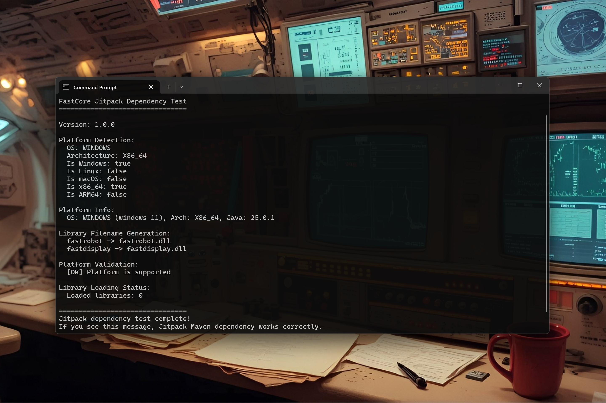

# FastCore — Unified JNI loader for Java native libraries [ALPHA]

> **Cross-platform native library loading** for Java 17+ — Windows, Linux, macOS

[](https://www.java.com)
[](https://maven.apache.org)
[](https://opensource.org/licenses/MIT)

[](https://www.youtube.com/watch?v=qqI7Am1u5Bs)

---

## Quick Start

```java
import fastcore.FastCore;

// Load a native library
FastCore.loadLibrary("fastrobot");

// Check platform
if (FastCore.isWindows()) {
    System.out.println("Running on Windows");
}

// Get platform info
System.out.println(FastCore.getPlatformInfo());
```

---

## Features

- **Cross-platform** — Windows (.dll), Linux (.so), macOS (.dylib)
- **Automatic extraction** — Native libraries from JAR to temp
- **Smart loading** — System path first, fallback to extracted
- **Zero dependencies** — Pure Java

---

## Installation

### Maven (JitPack)

```xml
<repositories>
    <repository>
        <id>jitpack.io</id>
        <url>https://jitpack.io</url>
    </repository>
</repositories>

<dependency>
    <groupId>com.github.andrestubbe</groupId>
    <artifactId>fastcore</artifactId>
    <version>v1.0.0</version>
</dependency>
```

### Gradle (JitPack)

```groovy
repositories {
    maven { url 'https://jitpack.io' }
}

dependencies {
    implementation 'com.github.andrestubbe:fastcore:v1.0.0'
}
```

---

**Part of the FastJava Ecosystem** — *Making the JVM faster.*
