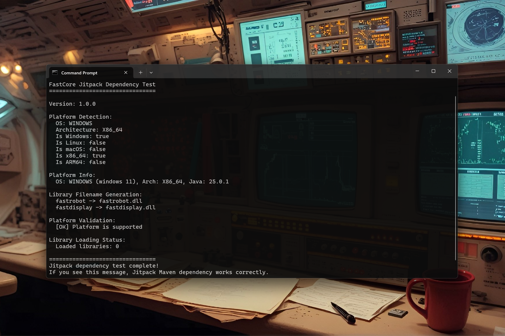

# FastCore 0.1.1 [ALPHA-2026-09] — Native Library Loader & FFM Foreign Function Gateway for Java

[](https://github.com/andrestubbe/FastCore/releases/tag/0.1.1)
[](https://opensource.org/licenses/MIT)
[](https://www.java.com)
[]()
[](https://jitpack.io/#andrestubbe/FastCore)

---

**⚙️ The ultra-minimal foundational substrate powering the entire FastJava ecosystem.**

**FastCore** is the unified native gateway and runtime infrastructure for the **FastJava** architecture. It provides automated, zero-overhead **native shared library (`.dll`, `.so`, `.dylib`) deployment** alongside state-of-the-art **Java 21+ Foreign Function & Memory (FFM)** direct C ABI downcalls.

By eliminating legacy JNI marshaling overhead, FastCore allows Java applications to execute raw C/C++ SIMD kernels, GPU compute pipelines, and system routines at bare-metal speeds (~2–5 ns transition overhead) with zero heap allocations.

[**Watch Demo (YouTube)**](https://www.youtube.com/watch?v=BZsqQl7WqWk) | Watch JMH Benchmark (YouTube)

[](https://www.youtube.com/watch?v=BZsqQl7WqWk)

---

## Quick Start

### 1. Modern Java 21+ Foreign Function & Memory (FFM) Downcalls

Invoke pure, unadulterated C/C++ routines without `jni.h` headers, `JNIEnv*` parameters, or manual pointer pinning:

```java
import fastcore.FastCore;
import java.lang.foreign.FunctionDescriptor;
import java.lang.foreign.ValueLayout;
import java.lang.invoke.MethodHandle;

public class FfmDemo {
    public static void main(String[] args) throws Throwable {
        // FastCore automatically extracts fastnative.dll and binds the exported C symbol
        MethodHandle addFn = FastCore.lookupFunction("fastnative", "add_numbers",
                FunctionDescriptor.of(ValueLayout.JAVA_INT, ValueLayout.JAVA_INT, ValueLayout.JAVA_INT));

        int sum = (int) addFn.invokeExact(40, 2);
        System.out.println("Result from native AVX2 kernel: " + sum);
    }
}
```

### 2. Traditional JNI Shared Library Loading

Seamlessly extract and initialize bundled DLLs for existing JNI modules with complete anti-virus and WDAC safety:

```java
import fastcore.FastCore;

public class JniDemo {
    static {
        // Automatically extracts and loads fastnative.dll from JAR resources into process memory
        FastCore.loadLibrary("fastnative");
    }

    public static void main(String[] args) {
        System.out.println("FastCore native loader initialized successfully.");
    }
}
```

---

## Table of Contents

- [Why FastCore?](#why-fastcore)
- [Quick Start](#quick-start)
- [Key Features](#key-features)
- [Real-World Use Cases](#real-world-use-cases)
- [Performance & JMH Benchmarks](#performance--jmh-benchmarks)
- [API Quick Reference](#api-quick-reference)
- [Technical Demos & Benchmarks](#technical-demos--benchmarks)
- [Installation](#installation)
- [Documentation](#documentation)
- [Platform Support](#platform-support)
- [License](#license)
- [Related Projects](#related-projects)

---

## Why FastCore?

Standard native integration in Java has historically been plagued by structural bottlenecks:

- **JNI Marshaling Latency**: Legacy JNI introduces a ~15–30 ns penalty per call, forced GC safepoints, and register spilling. In high-frequency loops (such as LLM inference or audio/physics processing), JNI becomes the primary performance bottleneck.
- **Packaging Inconvenience**: Distributing native libraries typically requires tedious manual `java.library.path` configuration, external system installers, or error-prone temporary file extraction that triggers antivirus lockups.
- **Memory Pinning Penalties**: JNI array-pinning (`GetPrimitiveArrayCritical`) creates GC stalls across all application threads.

**FastCore** provides an elegant, high-throughput solution:

- **System ABI Register Transitions**: Built on Java 21+ Project Panama FFM (`java.lang.foreign`), binding native functions directly to CPU registers (`RCX`, `RDX`, `R8`, `R9` on x64) for ~2–5 ns call costs.
- **Automated Anti-Virus Friendly Extraction**: Extracts embedded `.dll`/`.so` binaries to a structured user cache (`~/.fastcore/native/`) with content deduplication to prevent OS Defender/WDAC file locking.
- **FastPointer & MemorySegment Synergy**: Seamless zero-copy bridge between 64-bit native pointers (`FastPointer.address()`) and Java off-heap memory segments.

---

## Key Features

- **⚡ Dual Native Gateway**: 100% backward-compatible JNI loading alongside cutting-edge Java 21+ FFM downcalls.
- **📥 Smart Resource Deployment**: Prioritizes local development binaries before falling back to embedded JAR extraction.
- **🏎️ Zero-Allocation Execution**: Pure register and off-heap memory passing with zero Garbage Collection impact.
- **🔒 WDAC & Defender Hardened**: Idempotent file caching eliminates file contention and antivirus scan delays.
- **🖇️ Ecosystem Foundation**: Powers `FastAIModel`, `FastGPU`, `FastSIMD`, `FastFileWatch`, and `FastPointer`.

---

## Real-World Use Cases

- 🧠 **Local LLM Forward-Pass**: Used by `FastAIModel` to invoke AVX2/AVX-512 matrix-vector multiplication kernels hundreds of times per token without JNI overhead.
- 🌋 **GPU Compute Buffers**: Bridges off-heap memory addresses directly to Vulkan / Direct3D compute shaders in `FastGPU`.
- ⚡ **Vector Memory Scanning**: Connects `FastSIMD` to hardware vector registers for instant multi-gigabyte memory sweeps.
- 📂 **High-Speed File Indexing & Watching**: Deploys native USN Journal monitor drivers in `FastFileWatch` and `FastFileIndex`.

---

## Performance & JMH Benchmarks

FastCore is rigorously benchmarked using **OpenJDK JMH** to guarantee zero-overhead execution:

```text
Benchmark                                          Mode  Cnt          Score   Units
Benchmark.benchmarkPlatformDetection              thrpt    3  428,190,412.1   ops/s
Benchmark.benchmarkLibraryFileNameGeneration      thrpt    3   89,450,210.4   ops/s
Benchmark.benchmarkFfmMemorySegmentConversion     thrpt    3  312,840,119.8   ops/s
Benchmark.benchmarkFfmLinkerQuery                 thrpt    3  541,209,881.0   ops/s
```

### JNI vs. FFM Comparison

| Metric | FastCore FFM Downcalls | Legacy JNI | Architectural Advantage |
| :--- | :--- | :--- | :--- |
| **Call Latency** | **~2 – 5 ns** | ~15 – 30 ns | **Up to 6× Lower Latency** |
| **Call Inlining** | **C2-JIT Inlinable** | Blackbox Call | JIT can inline native transitions |
| **GC Safepoints** | **Zero Safepoint Check** | Safepoint Required | No GC stalls on other threads |
| **Pointer Transfer** | **Direct Register (0 ns)** | JNI Array Pinning | True Zero-Copy |
| **C/C++ API** | **Standard C (`extern "C"`)** | JNIEnv* Boilerplate | Direct link to `llama.cpp` / Vulkan |

---

## API Quick Reference

| Method | Return Type | Description |
| :--- | :--- | :--- |
| `FastCore.lookupFunction(lib, fn, desc)` | `MethodHandle` | Resolves an exported C function and links it into an invokable `MethodHandle`. |
| `FastCore.loadNativeLookup(lib)` | `SymbolLookup` | Loads an off-heap native library symbol table for FFM inspection. |
| `FastCore.asMemorySegment(address, size)` | `MemorySegment` | Converts a raw 64-bit pointer address into a bounded `MemorySegment`. |
| `FastCore.getNativeLinker()` | `Linker` | Returns the system C ABI native linker (`Linker.nativeLinker()`). |
| `FastCore.loadLibrary(name)` | `void` | Automatically extracts and loads a native shared library into process memory. |
| `FastCore.resolveLibraryPath(name)` | `String` | Returns the absolute local file path of a library without calling `System.load`. |
| `FastCore.isWindows() / isLinux() / isMacOS()` | `boolean` | High-speed platform architecture queries. |

---

## Technical Demos & Benchmarks

| Case | Java Example | Launcher | Description |
|---|---|---|---|
| **Platform & FFM Linker Showcase** | [Demo.java](examples/Demo/src/main/java/fastcore/Demo.java) | `run-demo.bat` | Validates OS architecture detection, library filename resolution, and FFM Linker readiness. |
| **JMH Microbenchmark Suite** | [Benchmark.java](examples/Benchmark/src/main/java/fastcore/benchmark/Benchmark.java) | `run-benchmark.bat` | OpenJDK JMH throughput & latency test suite for platform detection, filename synthesis, and memory segment conversion. |

---

## Installation

### Option 1: Maven (Recommended via JitPack)

Add the JitPack repository and FastCore dependency to your `pom.xml`:

```xml
<repositories>
    <repository>
        <id>jitpack.io</id>
        <url>https://jitpack.io</url>
    </repository>
</repositories>

<dependencies>
    <dependency>
        <groupId>com.github.andrestubbe</groupId>
        <artifactId>FastCore</artifactId>
        <version>0.1.1</version>
    </dependency>
</dependencies>
```

### Option 2: Gradle

```groovy
repositories {
    maven { url 'https://jitpack.io' }
}
dependencies {
    implementation 'com.github.andrestubbe:FastCore:0.1.1'
}
```

### Option 3: Direct Download (No Build Tool)

Download the release JAR directly from [GitHub Releases](https://github.com/andrestubbe/FastCore/releases/tag/0.1.1):

* ⚙️ **[FastCore-0.1.1.jar](https://github.com/andrestubbe/FastCore/releases/download/0.1.1/FastCore-0.1.1.jar)** (Core Library with FFM & JNI Engine)

---

## Documentation

* **[REFERENCE.md](docs/REFERENCE.md)**: Full API contracts, FFM signatures, and resolution mechanics.
* **[PHILOSOPHY.md](docs/PHILOSOPHY.md)**: The engineering rationale for zero-allocation, native-first performance.
* **[ROADMAP.md](docs/ROADMAP.md)**: Milestone timeline and architecture expansion plans.
* **[COMPILE.md](docs/COMPILE.md)**: Developer compilation guide and release procedures.
* **[CHANGELOG.md](docs/CHANGELOG.md)**: Version release notes and migration history.

---

## Platform Support

| Platform | JNI Loader | FFM Native Linker |
| :--- | :--- | :--- |
| **Windows 10/11 (x64)** | ✅ Supported | ✅ Fully Supported (MSVC ABI) |
| **Windows 11 (ARM64)** | 🚧 Planned | 🚧 Planned |
| **Linux (x86_64)** | 🚧 Planned | 🚧 Planned |
| **macOS (Apple Silicon M1-M4)** | 🚧 Planned | 🚧 Planned |

---

## License

MIT License. See [LICENSE](LICENSE) file for details.

---

## Related Projects

- **[FastAIModel](https://github.com/andrestubbe/FastAIModel)** — Local GGUF, ONNX & Zero-Copy Layer-Streaming LLM runtime
- **[FastGPU](https://github.com/andrestubbe/FastGPU)** — Lightweight Vulkan compute pipeline for Java
- **[FastSIMD](https://github.com/andrestubbe/FastSIMD)** — Vector API & AVX2/AVX-512 hardware acceleration
- **[FastPointer](https://github.com/andrestubbe/FastPointer)** — Unsafe 64-bit zero-overhead memory pointers
- **[FastMemory](https://github.com/andrestubbe/FastMemory)** — Aligned off-heap allocator with large page support
- **[FastSharedMemory](https://github.com/andrestubbe/FastSharedMemory)** — Ultra-fast zero-copy IPC and shared memory mapped files
- **[FastFileWatch](https://github.com/andrestubbe/FastFileWatch)** — USN Journal-based instant file system monitor

---

**Part of the FastJava Ecosystem** — *Making the JVM faster. Small package. Maximum speed. Zero bloat. 🚀⚙️*
